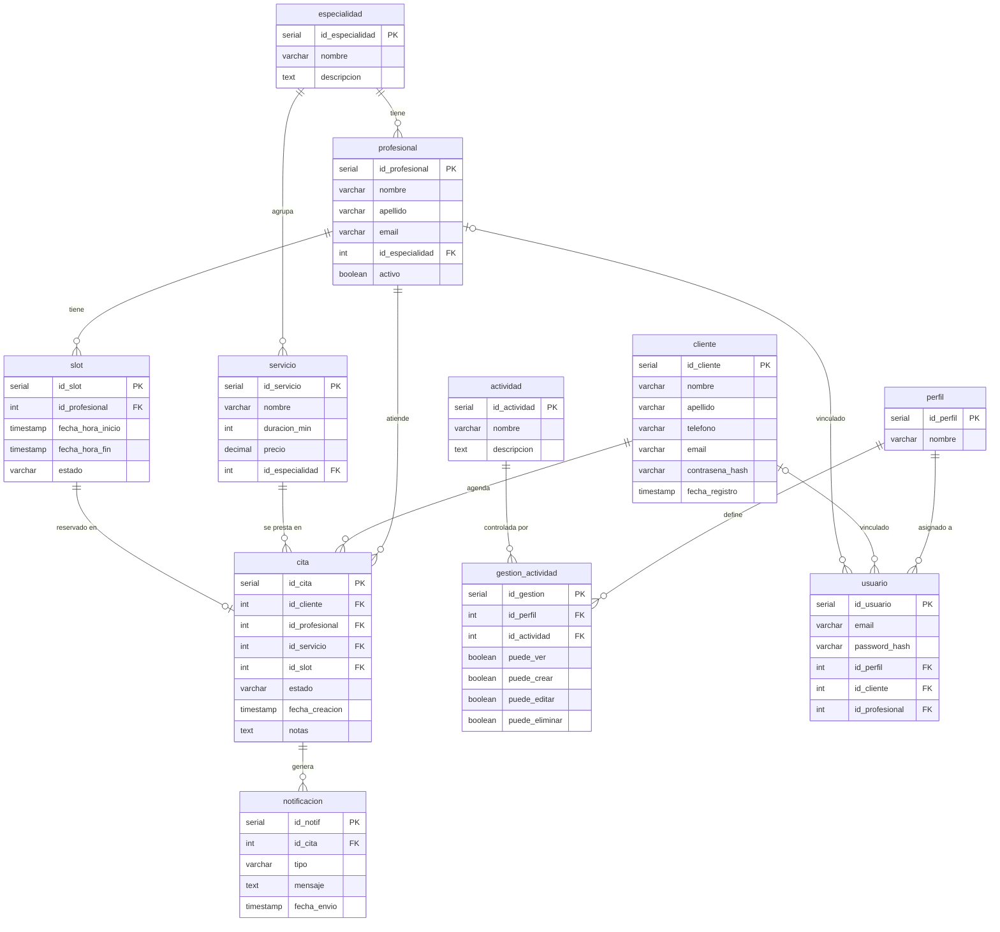

# Reservas-Citas

Sistema web de reserva de citas médicas desarrollado con Flask y PostgreSQL.
Proyecto académico — Bases de Datos

**John Sebastian Mantilla Manzano**

---

## Stack Tecnológico

| Capa | Tecnología |
|---|---|
| Backend | Python 3.10+ / Flask |
| Base de datos | PostgreSQL 15 |
| Conexión BD | psycopg2 (sin ORM) |
| Frontend | HTML + CSS + Jinja2 |
| Infraestructura | Docker Compose |

---

## Modelo de Datos — 11 tablas

| Tabla | Descripción |
|---|---|
| `especialidad` | Especialidades médicas |
| `profesional` | Profesionales vinculados a una especialidad |
| `cliente` | Clientes del sistema |
| `servicio` | Servicios con duración y precio |
| `slot` | Franjas de disponibilidad por profesional |
| `cita` | Reservas de citas (transaccional) |
| `notificacion` | Notificaciones automáticas por cita |
| `perfil` | Roles del sistema (admin, profesional, cliente) |
| `actividad` | Módulos del sistema |
| `gestion_actividad` | Permisos por perfil y módulo (RBAC) |
| `usuario` | Usuarios con autenticación y rol asignado |
| `auditoria` | Registro automático de cambios via triggers |


---
## Estructura del Proyecto

```
reservas-citas/
├── backend/
│   ├── app/
│   │   ├── models/
│   │   ├── routers/          # Blueprints Flask por módulo
│   │   ├── schemas/
│   │   ├── static/
│   │   │   └── css/
│   │   ├── templates/
│   │   │   └── pages/        # HTML por módulo
│   │   ├── database.py       # Pool de conexiones psycopg2
│   │   ├── main.py           # App Flask
│   │   └── utils.py          # Decoradores de permisos
│   ├── Dockerfile
│   └── requirements.txt
├── db/
│   ├── backups/
│   └── init/
│       ├── 01_estructura.sql # DDL: tablas y relaciones
│       ├── 02_datos.sql      # DML: datos semilla
│       └── 03_auditoria.sql  # Tabla + triggers PL/pgSQL
├── .env.example
├── docker-compose.yml
└── README.md
```
---

## Requisitos

- Python 3.10+
- Docker Desktop
- Git

---

## Instalación y uso

### 1. Clonar el repositorio

```bash
git clone https://github.com/tu-usuario/reservas-citas.git
cd reservas-citas
```

### 2. Configurar variables de entorno

```bash
cp .env.example .env
```

### 3. Levantar PostgreSQL con Docker

```bash
docker compose up -d
```

### 4. Crear estructura y datos en la BD

```bash
docker exec -i reservas_citas_db psql -U reservas_user -d mmj_reservas_citas < db/init/01_estructura.sql
docker exec -i reservas_citas_db psql -U reservas_user -d mmj_reservas_citas < db/init/02_datos.sql
docker exec -i reservas_citas_db psql -U reservas_user -d mmj_reservas_citas < db/init/03_auditoria.sql
```

### 5. Instalar dependencias Python

```bash
cd backend
python3 -m venv venv
source venv/bin/activate
pip install -r requirements.txt
```

### 6. Correr la aplicación

```bash
python -m flask run
```

Visita `http://127.0.0.1:5000`

---

## Usuarios de prueba

| Email | Contraseña | Perfil | Acceso |
|---|---|---|---|
| `admin@reservas.com` | `admin123` | Admin | Todo el sistema |
| `c.ramirez@clinica.com` | `prof123` | Profesional | Sus citas y slots |
| `maria.lopez@email.com` | `cliente123` | Cliente | Sus propias citas |

---

## Sistema de Permisos (RBAC)

| Módulo | Admin | Profesional | Cliente |
|---|---|---|---|
| Especialidades | CRUD | Ver | — |
| Profesionales | CRUD | Ver | — |
| Clientes | CRUD | Ver | — |
| Servicios | CRUD | Ver | Ver |
| Slots | CRUD | Ver/Crear/Editar | Ver |
| Citas | CRUD | Ver (propias) | Ver/Crear/Cancelar |
| Notificaciones | Ver todas | Ver (propias) | Ver (propias) |
| Auditoría | Ver | — | — |
| Usuarios | CRUD | — | — |

---

## Auditoría

Todas las tablas están monitoreadas por triggers PL/pgSQL.
Cada `INSERT`, `UPDATE` o `DELETE` queda registrado automáticamente en la tabla `auditoria` con:

- Tabla afectada
- Tipo de operación
- Usuario de PostgreSQL
- Fecha y hora exacta
- JSON con datos antes y después del cambio

El reporte de auditoría está disponible en `/auditoria` con filtros por fecha, tabla y operación.

---

## Nombre de la base de datos

`DB_reservas_citas`

---

## Licencia

MIT
